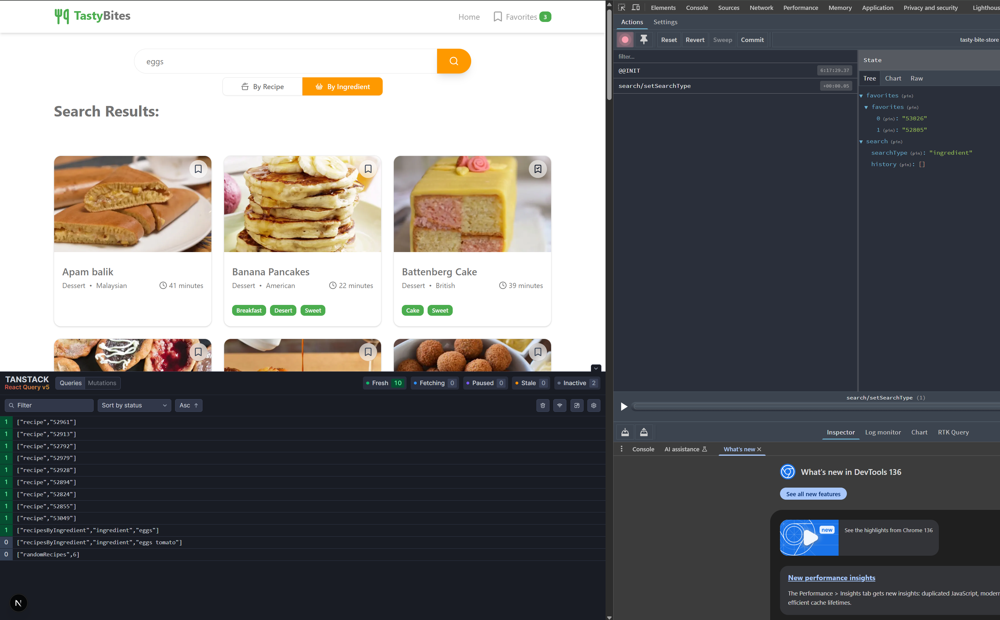

# TastyBites - Recipe Finder Application

TastyBites is a user-centric recipe finder application built with [Next.js](https://nextjs.org), allowing users to discover recipes by ingredients or keywords.

## Core Features

### Recipe Search

- Search by ingredients or keywords (supports multi-ingredient search)
- Dynamic results updating in real-time
- Error handling for invalid or empty searches
- Search state persists across page refreshes using session storage

### Recipe Views

- Responsive grid layout of recipe cards
- Each card displays:
  - Recipe name
  - Image with hover zoom effect
  - Estimated cooking time
  - Category tags
- Full-screen recipe detail dialog with:
  - Ingredients list
  - Cooking instructions
  - Preparation time
  - Responsive layout for mobile/desktop

### Favorites System

- Save favorite recipes locally
- Quick access to saved recipes
- Persistent storage using browser's local storage

## Tech Stack

- **Framework**: [Next.js](https://nextjs.org) with TypeScript
- **UI Components**: [shadcn/ui](https://ui.shadcn.com/)
- **Styling**: [Tailwind CSS](https://tailwindcss.com/) v4
  - Custom theme defined in `globals.css` using CSS variables and OKLCH colors
  - Responsive design
  - Custom focus styles
- **State Management**: [Zustand](https://zustand-demo.pmnd.rs/)
- **API Integration**:
  - [TheMealDB API](https://www.themealdb.com/api.php)
  - Axios for HTTP requests
  - TanStack Query for data fetching
- **Testing**: Comprehensive unit test coverage

## Getting Started

1. Clone the repository
2. Install dependencies:
   ```bash
   npm install
   ```
3. Create a `.env.local` file with:
   ```
   NEXT_PUBLIC_API_BASE_URL=https://www.themealdb.com/api/json/v1/1/
   ```
4. Start the development server:
   ```bash
   npm run dev
   ```
5. Open [http://localhost:3000](http://localhost:3000)

## Development

### Environment Setup

The project uses environment variables for configuration. Copy `.env.example` to `.env.local` and adjust values as needed.

### Theme Configuration

Theme customization is handled in `src/app/globals.css` using CSS variables and OKLCH colors for better color space support. The theme includes custom variants and can be modified by updating the CSS variables in this file.

### Development Tools

The project includes powerful development tools for debugging and monitoring application state:

#### TanStack Query DevTools



Built-in development tools help monitor and debug API requests and cache state:

- Real-time view of query states and data
- Cache inspection and manipulation
- Request timing and performance metrics
- Query invalidation debugging

#### State Management DevTools

For debugging global state:

- Zustand supports Redux DevTools out of the box
- View and track state changes in real-time
- Time-travel debugging
- Action history and state snapshots

To enable DevTools:

1. Install [Redux DevTools browser extension](https://chrome.google.com/webstore/detail/redux-devtools/lmhkpmbekcpmknklioeibfkpmmfibljd)
2. TanStack Query DevTools are automatically enabled in development mode
3. Open browser DevTools and find the Redux tab for state inspection

### State Management

- Global state managed with Zustand
- Search state persists in session storage
- Favorites stored in local storage
- TanStack Query for API data caching

### Accessibility Features

- ARIA labels and roles
- Keyboard navigation support
- Screen reader friendly
- ARIA live regions that announce dynamic updates (e.g., search results, recipe loading states, favorite toggles)
- Visually hidden dialog titles
- Custom focus styles

### Performance Optimizations

- IntersectionObserver for efficient DOM management:
  - Defers loading of heavy DOM elements (images, text) until visible
  - Reduces initial page load by hydrating components only when in viewport
  - Optimizes memory usage in image-rich recipe lists
- Lazy loading of components
- Code splitting
- Image optimization with next/image
- Component memoization where beneficial
- TanStack Query for efficient data caching

## Deployment

Deploy easily on [Vercel](https://vercel.com/new?utm_medium=default-template&filter=next.js&utm_source=create-next-app&utm_campaign=create-next-app-readme):

1. Push your code to GitHub
2. Import the repository to Vercel
3. Configure environment variables
4. Deploy

For more details, see [Next.js deployment documentation](https://nextjs.org/docs/app/building-your-application/deploying).

## API Configuration

This project uses Axios for API requests. The base URL for the API is configured using an environment variable. To change the API endpoint, edit the `.env.local` file at the root of the project:

```
NEXT_PUBLIC_API_BASE_URL=https://www.themealdb.com/api/json/v1/1/
```

The Axios instance in `src/lib/api.ts` will automatically use this value.

## Features history

- handle Type search storage on the Session, so on every refresh the user should have always the same selection
- Search state is now managed globally with Zustand for a more scalable and maintainable architecture
- The search input now features a custom focus style: instead of a border, the background darkens for better UX
- The search result by ingredient uses a dedicated component, which is lazy loaded. This separation is necessary to enable true lazy loading and code splitting, so only the content visible on the screen is loaded, improving performance and user experience especially for large result sets.
- fine tuning for search, in the home page removed the binding with the store for the query, still to fix the flikering for the searchType that recover data from the store
- UI badge for recipe time and type in RecipeDetail, with accessibility improvements
- Fake cooking time (randomized) for recipes, consistently shown in RecipeCard and RecipeDetail
- Clock icon and time aligned right in RecipeCard
- RecipeCardSkeleton updated to match new time/clock UI (if implemented)
- Placeholder badge shown if no tags are present in RecipeCard
- Accessibility improvements for RecipeDetailSidebar (ARIA labels, roles, live regions)
- getAdjustedMeasure now uses useCallback for performance
- New grid layout to fit the clock icon in the card
- Full screen dialog for RecipeDetail, with vertical scroll and a larger, repositioned close button
- Reusable RecipeDetailDialog component to show recipe details in a dialog
- Ingredients section is now shown in different positions on mobile (below image) and desktop (sidebar)

- Full-page, accessible recipe detail dialog using shadcn/ui Dialog, with responsive and scrollable layout
- Dialog can be opened from RecipeCard in FeaturedRecipes and other lists
- Ingredients section is now responsive and accessible (mobile/desktop)
- Improved accessibility: keyboard navigation, screen reader support, and visually hidden dialog titles
- Consistent card heights even when tags are missing
- RecipeCard image zoom-in effect on hover
- Improved test coverage for RecipeCardDynamic, RecipeDetail, AdjustServings, and RecipeDetailSidebar
- UI/UX tweaks: badge usage, clock icon alignment, grid layout, and padding
- Hydration safety: removed invalid button nesting, fixed next/image test paths
- Multi-ingredient search: You can now search recipes by multiple ingredients (e.g., "tomato egg"). Only recipes containing all specified ingredients are returned.

### nice to have

A set of feature that i would add if i have more time

- clear search X like google on input
- integrate playwright
- use the dictionay build-in in Next for labels
- history hint when prompting in search
- filter by category/Region on the search Results
